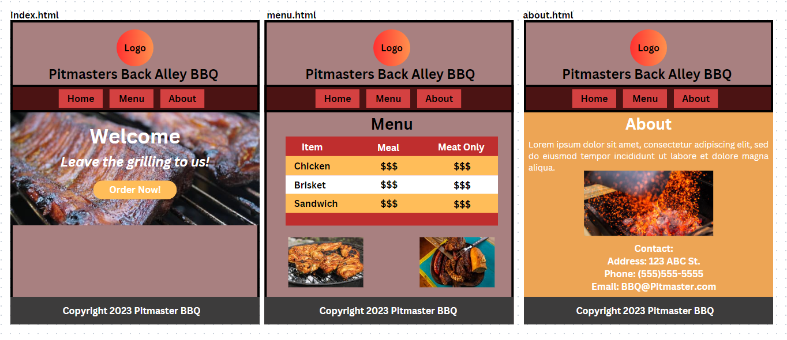

<h2>About</h2>

This is my first CSS project based off of building a fake E-Commerce Website. It is also build upon my previous HTML project. It's loosely modeled after the real restaurant Pitmasters Back Alley BBQ. It has three pages - home, menu, and about. It features a table with fictitous prices and contact information. It also includes images on each page.

<h2>Wireframe</h2>

This is my plan for the wevsite using HTML and CSS. The wirefreame was created on Canva.com

<h2>Technology used</h2>

 The project uses HTML and CSS to structure the website.

<h2>Credits and Acknowledgements</h2>

Images used mostly came from unsplash.com and the Pitmasters website.  Parts of the HTML and CSS were refrenced from MDN and W3Schools.

<h2>Photo Credits</h2>

Logo and Brisket : <a href="https://pitmastersbackalleybbq.com">www.pitmastersbackalleybbq.com</a>

<h2>Code Credits</h2>

White-space Property : <a href="https://w3schools.com/cssref/pr_text_white-space.php">White-Space</a>

